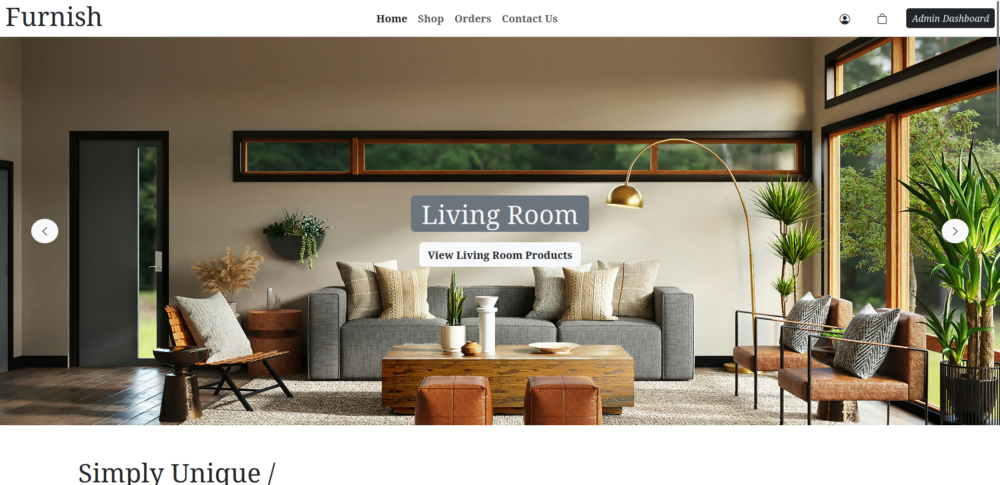
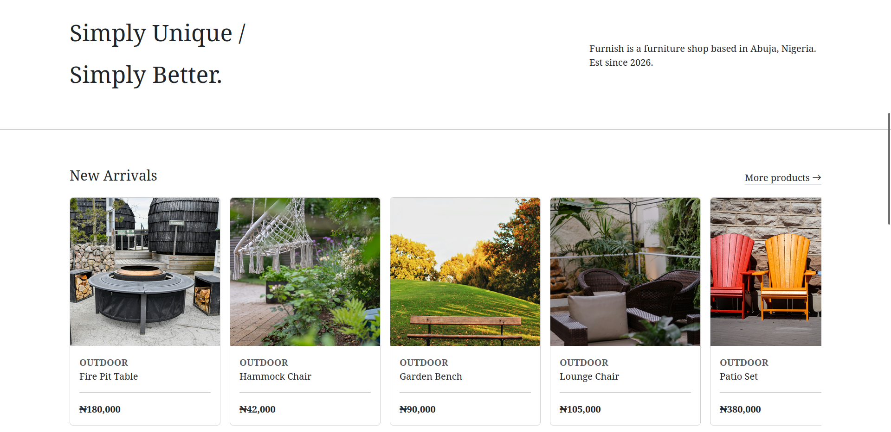
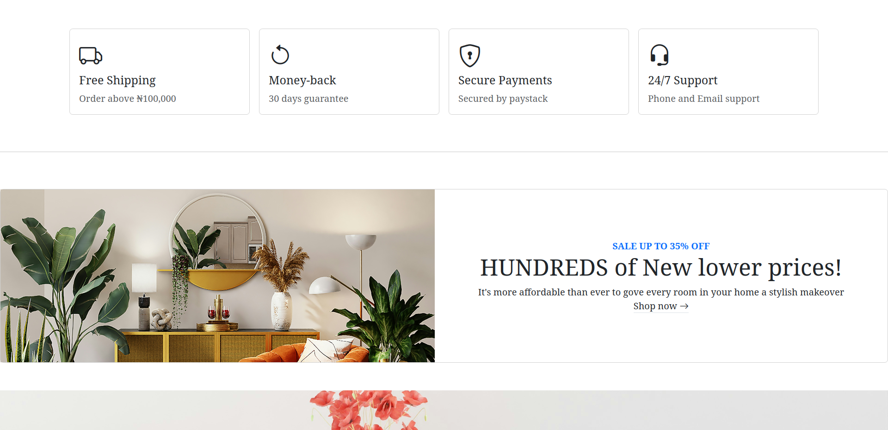
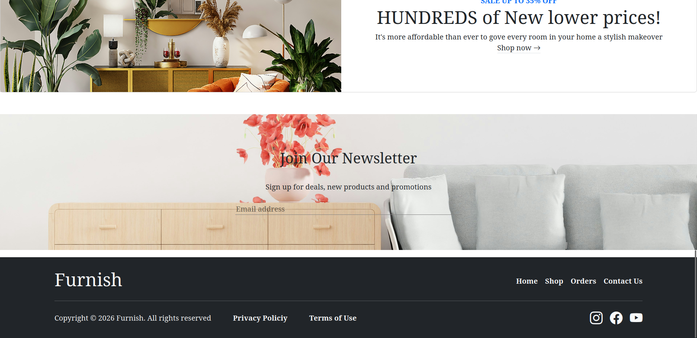
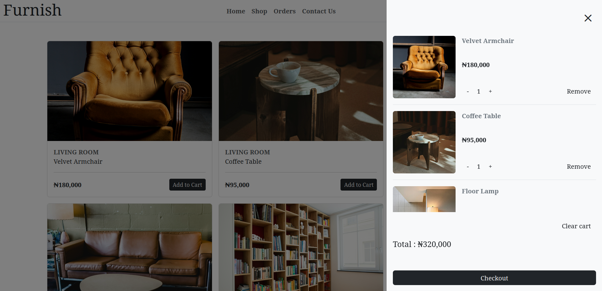
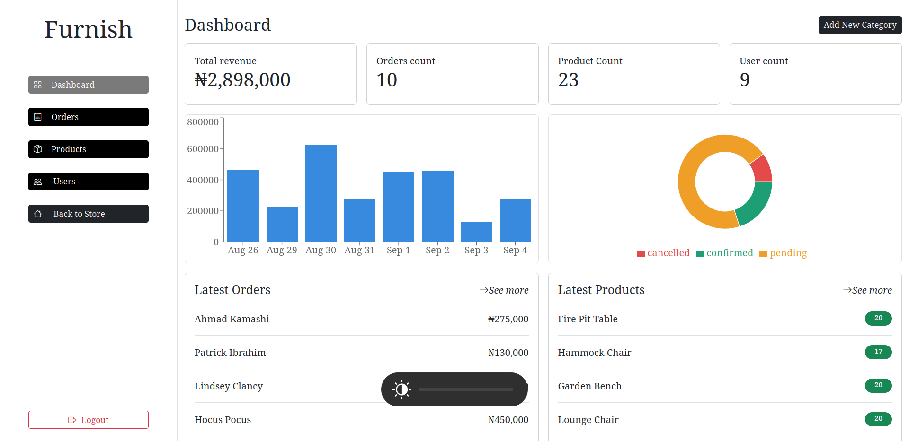

# Furnish Commerce

Furnish Commerce is a full-stack e-commerce platform for browsing products, managing a shopping cart, placing orders, and tracking orders. Using React, Node.js and Express and PostgreSQL to provide a full user shopping experience.

## Live Demo

[View Live Demo](https://furnish.abdals.site)

## Screenshot

**Home Page**





**Cart**


**Admin Dashboard**


## Features

- Browse products by category
- View products
- Add, update, and remove items from the cart
- Secure customer authentication and account access
- Email verification and password reset flow
- Google sign-in support
- Checkout and order creation
- Payment processing integration
- Order history and account management
- Admin dashboard for products, categories, and users

## Tech Stack

### Frontend
- React
- React Router
- Bootstrap
- Bootstrap icons
- Axios
- TanStack Query
- Recharts
- Vercel

### Backend
- Node.js
- Express.js
- PostgreSQL
- Prisma ORM
- JWT 
- Bcrypt
- Passport.js (Google OAuth)
- Cloudinary for image uploads
- Resend for transactional email
- Paystack integration for payments
- Render 

### Database
- Supabase

## Project Structure

```text
furnish-commerce/
├── client/        
│   ├── src/
│   ├── public/
│   └── package.json
├── server/                
│   ├── src/
│   ├── prisma/
│   └── package.json
├── package.json           
├── .gitignore
└── README.md
```

## Getting Started

### 1. Clone the repository

```bash
git clone https://github.com/abdalsimam1-sketch/furnish-commerce.git
```

### 2. Install dependencies

**Open your terminal**

```bash
npm install

cd client
npm install

cd .. 
cd server
npm install 
```

### 3. Configure environment variables

Create a `.env` file inside the `client` directory:

```env
**Please note that the api url is just the localhost using the port number of your choosing followed by /api/v1
VITE_API_URL= http://localhost:[YOUR_SERVER_PORT_NUMBER]/api/v1

```
Create a `.env` file inside the `server` directory:

```env

PORT
NODE_ENV
DATABASE_URL
ACCESS_SECRET
REFRESH_SECRET
ACCESS_LIFETIME
REFRESH_LIFETIME
CLIENT_URL

GOOGLE_CLIENT_ID
GOOGLE_CLIENT_SECRET
GOOGLE_CALLBACK_URL

PAYSTACK_SECRET_KEY
RESEND_API_KEY

CLOUDINARY_URL
CLOUDINARY_API_KEY
CLOUDINARY_API_SECRET
```

### 4. Set up the database

```bash
cd server
npx prisma generate
npx prisma migrate dev
```

### 5. Run the application

From the root folder:

```bash
npm run dev
```

This starts the client and server concurrently.

## Usage

- Open the frontend in the browser at `http://localhost:5173`
- Browse products and categories
- Add products to the cart
- Create an account or log in
- Complete the checkout flow
- View order history and account details

 **Please note that in order to get access to admin features you would have to promote a customer directly from the your database console**

## API Overview

The backend exposes REST endpoints under `/api/v1` for:

- Authentication
- Users
- Categories
- Products
- Cart
- Orders
- Payments
- Dashboard

## API PARTIAL DOCUMENTATION

[View API Documentation](https://documenter.getpostman.com/view/54829285/2sBYAvvW67)

## What I Learned

This project helped me strengthen my understanding of full-stack web development, how to make architectural decisions, how to structure a project in order to not lose control, integrate a payment, integrate Google O-auth 2.0, basic testing and also imporved my understanding on how to make your site more responsive 

## Challenges Faced

- For some features i really struggled to test them before merging the feature branch
- Modeling a realistic e-commerce data structure for users, carts, products, and orders
- Managing authentication and token refresh securely
- Integrating payment, email, and OAuth services
- Keeping frontend and backend logic consistent during checkout and admin tasks

## Future Improvements

- Add a better documenation for the api covering all the api endpoints
- Add product reviews and ratings
- Improve search and product filtering to all product pages 
- Add wishlist functionality
- Expand admin analytics dashboards to have more charts so the sales records can be better understood
- Add shipment tracking and order statuses
- Improve mobile responsiveness and accessibility
- Add more automated tests for critical flows

## Contributing

Contributions are welcome. To contribute:

1. Fork the repository
2. Create a feature branch
3. Make your changes
4. Open a pull request

## Portfolio Note

This project is a portfolio learning project that helped grasp the fundamentals of full-stack web development
